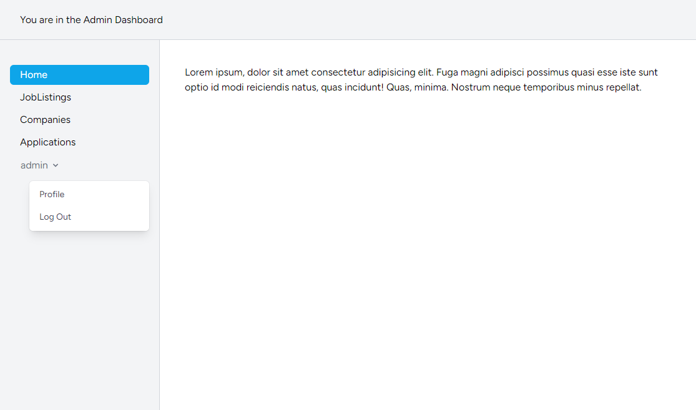
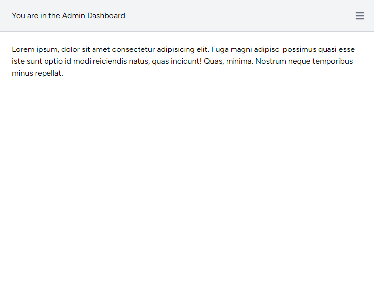

# Job Portal

Job Portal web application built with **Laravel 11**, **PHP 8.2**, **Blade**, **Tailwind CSS**, and **Alpine.js**.

The project is being developed as a portfolio application to demonstrate clean Laravel architecture, authentication, role-based authorization, CRUD operations, and real-world business logic.

> **Project Status:** 🚧 Under Development

---

## Features

### Authentication

* User authentication with Laravel Breeze
* Secure login and registration
* Role-based access control
* Admin middleware
* Admin account seeded automatically

---

## Database

The application currently includes the following entities:

* Users
* Companies
* Job Listings
* Applications

Implemented with:

* Eloquent Relationships
* Model Factories
* Database Seeders
* Admin Seeder
* Foreign Key Constraints

---

## Admin Panel

A custom responsive admin panel has been built using **Blade**, **Tailwind CSS**, and **Alpine.js**.

Current features include:

* Responsive dashboard layout
* Custom sidebar navigation
* Mobile sidebar toggle
* Alpine.js interactive menu
* Clean and lightweight interface

---

## Screenshots

### Admin Dashboard

---

### Admin Dashboard (Mobile screen)

## Tech Stack

* PHP 8.2
* Laravel 11
* MySQL
* Blade
* Tailwind CSS
* Alpine.js
* Laravel Breeze
* Eloquent ORM
* Git & GitHub

---

## Current Progress

* Laravel project setup
* Authentication with Breeze
* User roles
* Admin middleware
* Database design
* Eloquent relationships
* Model factories
* Database seeders
* Admin dashboard layout
* Responsive sidebar
* Alpine.js integration

---

## Upcoming Features

* Company Management (CRUD)
* Job Management (CRUD)
* Application Management
* Public Job Listings
* Job Search & Filtering
* Job Applications

---

## Author

**Ali Abdulhameed**

2026

